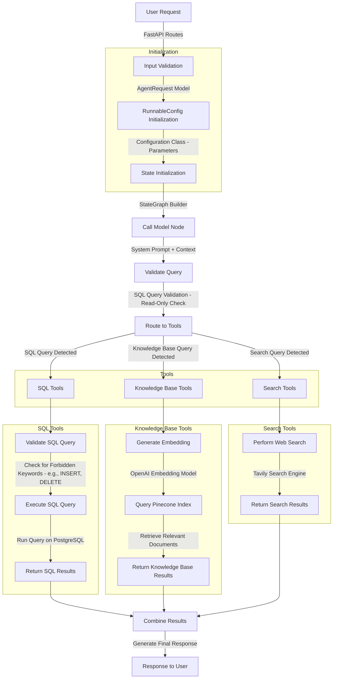

### Project Name

SmartQuery | Your AI Agent for Contextual Data Analysis


### Description

# SmartQuery | Reasoning-Driven AI Agent for SQL and Knowledge Retrieval

SmartQuery is an AI-powered agentic application designed to act not just as a translator of natural language into SQL, but as a true reasoning-driven data analyst. Unlike conventional AI agents that simply convert prompts into database queries, SmartQuery delivers inteligência com contexto: it reasons through user questions, decides what data sources to access, and dynamically combines structured (SQL) and unstructured (documents, PDFs, notes, strategy files) information to generate rich, contextual insights. This context-aware, multi-source reasoning makes it ideal for scenarios where knowledge lives not only in databases, but also in the documentation that surrounds them.

---

## 🔍 Overview

At its core, SmartQuery leverages:
- **Azure AI Agent Service** and OpenAI LLMs for natural language understanding
- **Reasoning workflows (ReAct)** for multi-step decision-making
- **RAG (Retrieval-Augmented Generation)** to enrich responses with document-based context
- **LangGraph** for agent orchestration and iterative thinking

It dynamically determines whether to:
- Run live SQL queries on user-provided PostgreSQL databases
- Retrieve semantic knowledge from user-uploaded documents (e.g., strategy files, PDFs, CSVs)
- Combine both sources into a unified, human-readable answer

---

## 🧠 What Makes it Agentic?
SmartQuery follows the **Reasoning + Acting (ReAct)** paradigm:

1. The agent reasons over the user’s question.
2. It determines the best action (SQL query, document lookup, or hybrid).
3. Executes the action, observes results.
4. Iterates until it produces a coherent, contextual response.

---

## 🎥 Veja a Demo

Check out how SmartQuery works in practice! Click the image below to watch the demo video:

[](https://offgridmartech.com.br/ai-microsoft-hackathon/smart_query_demo.mp4)

---

## 🚀 Use Cases
- Marketing teams exploring campaign performance metrics
- BI teams asking analytical questions without writing SQL
- Operations teams querying live databases and internal docs in one place

---

## 📊 Key Features
- ✅ Natural language chat interface powered by an AI agent
- 🔄 Multi-turn conversations with context retention
- 📁 Upload and manage documents (PDF, TXT, DOCX, CSV)
- 🧠 RAG pipeline with vector search (Pinecone or Supabase Vector)
- 👨‍💼 Multi-tenant: each user sees only their data, docs, and chats
- ⚡ Built with Python, Azure AI, Docker, FastAPI, PostgreSQL, LangGraph, Supabase

---

## ⚖️ API Endpoints

### `POST /invoke_last`
Processes user messages and returns the final agent response.

### `POST /stream`
Optional endpoint for real-time, streaming responses.

### `POST /load-data`
Uploads and indexes documents to the vector database.

### `GET /query-data`
Queries vectorized documents to retrieve context for the agent.

---

## 🛠️ Technologies Used
- **Language & Framework**: Python + FastAPI
- **AI Layer**: Azure AI Agent Service (OpenAI-based LLMs)
- **Agent Runtime**: LangGraph (ReAct architecture)
- **Database**: PostgreSQL
- **Auth/Storage**: Supabase
- **Vector Search**: Pinecone (pluggable)

---

## 🌐 Features in Development
- ⏰ Cron jobs for scheduled reports
- 📢 Proactive messages and alerts from the agent

---
##  Agentic Architecture


---
## 🧩 Data Model Overview


This multi-tenant data model powers an AI-driven analytics platform where each user's data—such as connections, conversations, and documents—is securely isolated and linked to their `auth.users.id`.

### Key Tables Overview

#### `database_connections`
- Stores connection info for external SQL databases.
- Includes credentials and cached schema data.

#### `knowledge_sources`
- Manages unstructured files (e.g., planning docs, market reports).
- Includes metadata and indexing for Retrieval-Augmented Generation (RAG).

#### `conversations`
- Registers user-agent sessions.
- Tracks titles, thread IDs, and timestamps to preserve interaction context.

#### `messages`
- Logs individual chat messages.
- Includes roles and timestamps to enable complete conversational history.

#### `profiles`
- Extends user data with optional profile fields like name.
- Useful for personalization.

---

## ♻️ Setup & Installation

### Prerequisites
- Python 3.9+
- PostgreSQL instance for SQL queries
- Supabase account for auth and file storage
- API keys: OpenAI, Pinecone, Tavily (optional)

### Installation

```bash
# Clone the repository
git clone https://github.com/your-repo/smartquery.git
cd smartquery

# Install dependencies
pip install -r requirements.txt

# Create .env file based on template
cp .env.example .env
# Add your credentials and API keys

# Run the app
uvicorn main:app --host 0.0.0.0 --port 8000 --reload
```

### Docker Support
```bash
docker build -t smart-query .
docker run -p 8000:8000 smart-query
```

---

## 📊 How It Works

1. **Connect to your database through the UI**  
   Easily select and connect your SQL data source in the interface.

   

2. **Upload unstructured sources for contextual retrieval**  
   Enrich the agent’s reasoning with supporting documents like PDFs, notes, and strategy files.

   

3. **Submit a natural language question via the UI**  
   Users can ask anything about the data — the agent understands your intent and gets to work.

   

4. AI Agent routes the task using reasoning and actions
The agent determines the best course of action, whether it's executing SQL queries, retrieving information from vectorized documents or both.

5. **Data retrieval and reasoning**  
   The agent executes the appropriate actions: it runs SQL queries or accesses unstructured sources, then analyzes and refines the result.

6. **Response generation**  
   The final answer is returned directly in the chat interface, with full context.

---

For more details, see the [[SmartQuery Documentation](https://offgridmartech.com.br/smart-query-documentation)].

### Language & Framework

- [x] Python
- [ ] C#
- [ ] Java
- [x] JavaScript/TypeScript
- [ ] Microsoft Copilot Studio
- [ ] Microsoft 365 Agents SDK
- [x] Azure AI Agent Service

### Project Repository URL

https://github.com/ingridandradedev/smart-query.git

### Deployed Endpoint URL

https://smartquery.offgridmartech.com.br/

### Project Video

https://offgridmartech.com.br/ai-microsoft-hackathon/smart_query_demo.mp4

### Team Members

ingridandradedev

### Registration Check

- [x] Each of my team members has filled out the registration form